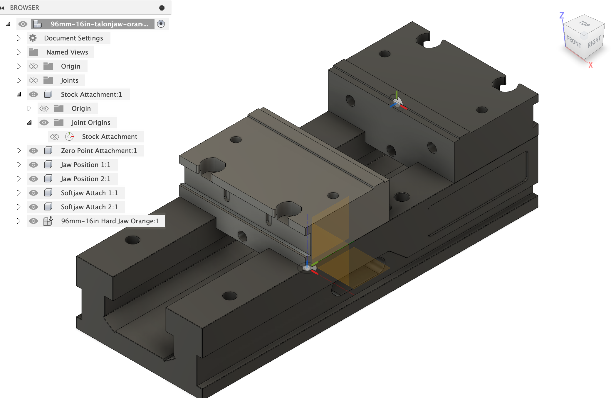
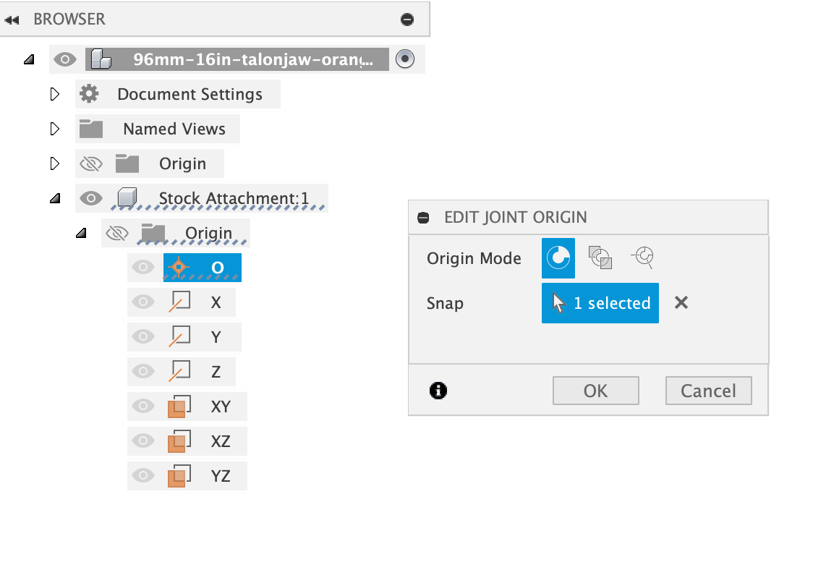
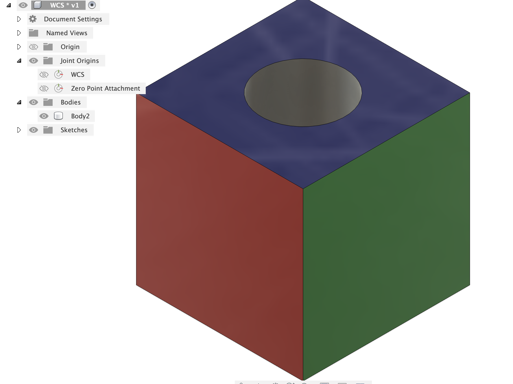
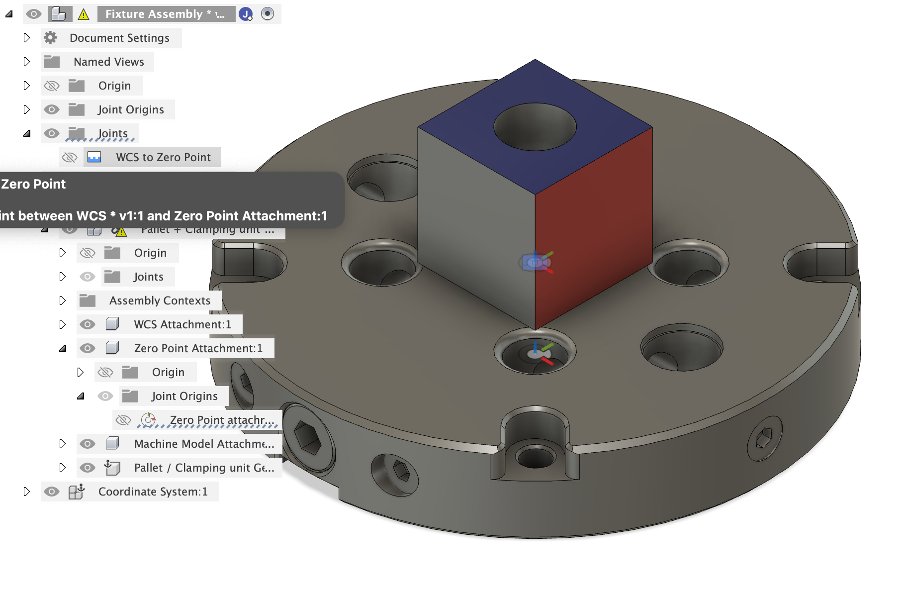
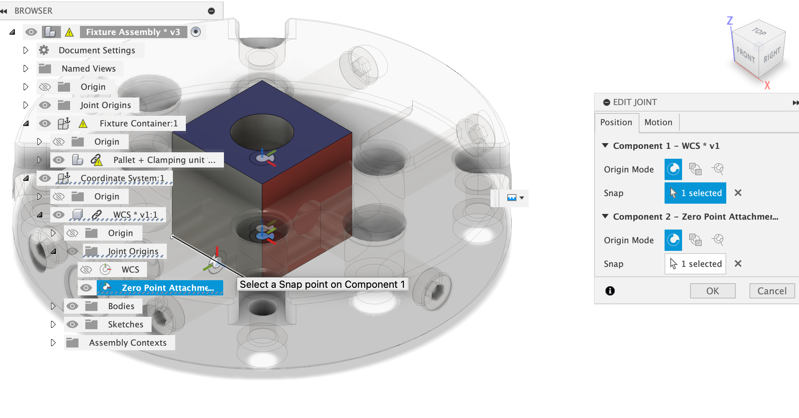
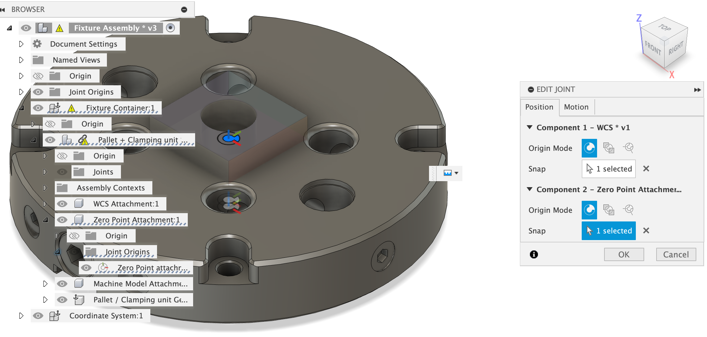

# Joint Origin Container

The Joint Origin Container (JOC) is the core concept that enables swappable fixturing assemblies to work. 
As the name suggests, a JOC is litterally a container created for the sole purpose of housing joint origins without any associated geometry or constraints inside that container. 

You need one JOC for each physical point in space you expect to consider. 
We'll elaborate on this more later, but in short if you labeled all the points in space you would care about on a given set of vises then each one would get a single JOC.

The single stand-alone joint origin is snapped to the origin of its parent container. 
But the container itself is not attached to any physical geometry. 
It's unconstrained and free to move in space. 

# Using Joints to create swappable geometry 

The magic of the JOC is that you can joint it to geometry, which effectively moves it to be locked to that geometry. 
But more importantly, you can actually joint it two separate geometries. 
Lets call them the sibling and parent joints, which when used together to locate geometry in space and to allow the replace functionality to swap geometry in while respecting those location constraints. 

In our case, we have three types of building block files: 

- Vise 
- Pallet 
- Work Coordinate System (WCS)

A sibling joint lives inside the building block file, where the JOC and the building-block-geometry are sibilings together. 

A parent joint lives in a file one layer up, where the building blocks are assembled together and a workflow can be built around them. 

## Sibling Joint

We use the term `sibling` on purpose, because the JOC lives in the same file as and at the same level of the model hierarchy as the geometry or other containers that you'll attach it to. 

## The Parent Joint

The `parent` joint lives the file that you insert a building block into. 
So a Fixture Assembly is constructured of one each of the three building blocks: Vise, Fixture, and WCS. 
You create a new file, then insert those building blocks into it. 
Then you can create an additional joint between two JOCs in the separate blocks, or between a JOC and some geometry in the parent file, to align them together in space. 

For example, to align the WCS to the Pallet

## JOCs and Nesting Building Blocks and The Top of the Hierarchy

The presence of a JOC in a file automatically implies that it will be nested within some higher level file. 
This goes along with the idea of `sibling` and `parent` joints and any time you have a JOC, you can expect to make one of each joint. 

You can also add JOC's into parent files, which themselves have child building blocks. 
We do this with the `Fixture Assembly` file, which contains one of each of the core building blocks, but also has its own JOC for the stock attachment. 

The `Stock Attachment` JOC means that the Fixture Assembly file is intended to itself be inserted into a higher level parent. 
In the framework given here, the parent file is the Workflow Template file.
You won't see any more JOC's at that level, since its the top of the entire framework hierarchy. 

Importantly, the top level file is where any geometry attached to model parameters can live as well. 
Its best to keep any parametric geometry out of the building block files because when they get inserted into their parents files those paraemters can't ride along unless you break the link to the original file. 
Since generally, you don't want to break that link, parameters in the child files are highly discouraged. 

## The Ancestor File 

Due to the details of how replace works in Fusion, this whole fixture assembly framework relies on 
each of the three types of building block files being derived from a common ancestor file. 

If you want to develop your own version of the framework, you would start by creating ancestor files with your desired JOC structure in them. 
Then each of your building block files would be generated by doing a `save as` from the ancestor file. 
This preserves critical IDs in the internal Fusion definition of the JOC and allows the replace to work as intended. 

Note that you can also use `save as` from any decendent of the original ancestor files. 
So you could make one vise file, then `save as` from that to create a new one. 
Change out the geometry in that and save it again. 
What is critical is that the JOCs and the joint origins inside them remain untouched.
If they are deleted and re-created (even with the same names) then the linage to the original ancestor file is broken and the replace command won't work. 

However, we don't recommend that you create your own structure. We've built one for you that is flexbile enough to handle most users needs. 
If you adopt our framework and our ancestor files then you can trade building blocks with other users and we as a community can all benefit. 

